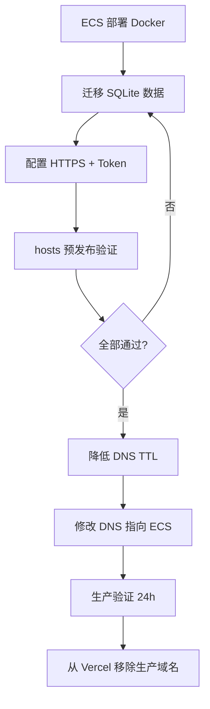

# Vercel → 阿里云 ECS 切换清单

将 `www.dbsourceaudio.com` 从 **Vercel（仅前端）** 切换到 **阿里云 ECS（官网 + Strapi + 数据库）**，并保留备案与 SEO。

## 当前 vs 目标

| 项目 | 当前（Vercel） | 目标（阿里云 ECS） |
|------|----------------|-------------------|
| 官网 `www` | Vercel 托管 Next.js | ECS Docker `web` + Nginx |
| 内容后台 `/admin` | Vercel Serverless API | 同上（连 ECS Strapi） |
| CMS `cms` | 无 / 不可用 | ECS Docker `strapi` |
| 数据 | Mock 或空 | PostgreSQL + uploads |
| 备案 | 粤ICP备2025373674号 | 需解析到大陆 ECS |

**为什么 Vercel 上数据不对：** GitHub 只有代码，没有 `data.db` 和 `uploads`。Vercel 无法跑 Strapi，除非另购数据库和媒体存储并单独部署 CMS。

---

## 切换前准备（必做）

按顺序完成，**全部打勾后再改 DNS**。

### 1. ECS 环境就绪

- [ ] 阿里云 ECS（建议 4核8G，Ubuntu 22.04）已购买
- [ ] 安全组开放 **80、443**（SSH 22 仅对你的 IP）
- [ ] 已安装 Docker + Docker Compose v2
- [ ] 代码已克隆：`git clone https://github.com/Bomi11653/dBsource.git`

### 2. 部署 Docker 栈

```bash
cd ~/dBsource/deploy
cp .env.example .env
nano .env   # 见下方「环境变量对照」
./scripts/deploy.sh
```

- [ ] `docker compose ps` 四个服务均为 `running`
- [ ] 用 **ECS 公网 IP** 临时访问正常（改 hosts 或直接用 IP 测 Nginx，若未绑域名）

### 3. 迁移数据（选项 2）

完整步骤：[MIGRATE-SQLITE-TO-POSTGRES.md](MIGRATE-SQLITE-TO-POSTGRES.md)

- [ ] 本地 `export-local-data.ps1` 导出成功
- [ ] `import-strapi-data.sh` 导入 PostgreSQL 成功
- [ ] `import-uploads.sh` 图片导入成功
- [ ] Strapi 后台可登录，产品约 112 条、案例约 14 条

### 4. HTTPS 证书

- [ ] 阿里云 SSL 免费 DV 证书已申请（`www` + `cms` 各一张，或通配符）
- [ ] 证书已放入：
  ```
  deploy/nginx/certs/www/fullchain.pem
  deploy/nginx/certs/www/privkey.pem
  deploy/nginx/certs/cms/fullchain.pem
  deploy/nginx/certs/cms/privkey.pem
  ```
- [ ] `nginx/conf.d/dbsource.conf` 中 HTTPS 块已取消注释
- [ ] `docker compose restart nginx`
- [ ] `https://cms.dbsourceaudio.com/admin` 可访问（先用 hosts 测试）

### 5. 环境变量与 Token

- [ ] `STRAPI_API_TOKEN` 已在 Strapi 后台创建（Full access）并写入 `deploy/.env`
- [ ] `NEXT_PUBLIC_USE_MOCK_DATA=false`
- [ ] `ADMIN_TOKEN` 已改为强密码（内容后台 `/admin/login`）
- [ ] `docker compose restart web`

### 6. 预发布验证（不切 DNS）

在 **本机 hosts** 临时指向 ECS IP（切换完记得删除）：

```
你的ECS公网IP  www.dbsourceaudio.com
你的ECS公网IP  cms.dbsourceaudio.com
```

Windows：`C:\Windows\System32\drivers\etc\hosts`（需管理员权限）

| 检查项 | URL | 预期 |
|--------|-----|------|
| 首页 | https://www.dbsourceaudio.com | 正常、有真实产品 |
| 产品列表 | /products | ~112 个产品 |
| 产品详情图 | 任意产品页 | 图片加载 |
| 案例 | /cases | 有案例数据 |
| 内容后台 | /admin/login | 可登录编辑 |
| Strapi | https://cms.dbsourceaudio.com/admin | 可登录 |
| 询盘/API | 提交联系表单 | 无 500 错误 |

- [ ] 以上全部通过

---

## 环境变量对照（Vercel → ECS）

在 Vercel 项目 **Settings → Environment Variables** 中配置的项，对应写入 `deploy/.env`：

| 变量 | Vercel（旧） | ECS `deploy/.env`（新） |
|------|--------------|-------------------------|
| `NEXT_PUBLIC_SITE_URL` | `https://www.dbsourceaudio.com` | 同左 |
| `NEXT_PUBLIC_CMS_URL` | 常缺失或错误 | `https://cms.dbsourceaudio.com` |
| `CMS_URL` | 常缺失 | `https://cms.dbsourceaudio.com` |
| `NEXT_PUBLIC_USE_MOCK_DATA` | 可能未设（默认 mock） | **`false`** |
| `STRAPI_API_TOKEN` | 空或过期 | 生产 Strapi 新 Token |
| `ADMIN_TOKEN` | 有 | 强密码 |
| `DEEPSEEK_API_KEY` | 可选 | 可选，同步即可 |

ECS 额外需要（Vercel 没有）：

```
POSTGRES_PASSWORD=...
APP_KEYS=...
JWT_SECRET=...
ADMIN_JWT_SECRET=...
API_TOKEN_SALT=...
TRANSFER_TOKEN_SALT=...
```

`web` 镜像在 **构建时** 写入 `NEXT_PUBLIC_*`；改域名后需重新构建：

```bash
cd ~/dBsource/deploy
docker compose build web
docker compose up -d web
```

---

## DNS 切换（正式割接）

### 切换前记录（便于回滚）

记下 Vercel 当前 DNS 记录（阿里云域名控制台或 Vercel Domains 页）：

| 主机记录 | 类型 | 旧值（Vercel） | 新值（ECS） |
|----------|------|----------------|-------------|
| `www` | A / CNAME | `cname.vercel-dns.com` 等 | **ECS 公网 IP**（A 记录） |
| `@` | A | 视情况 | ECS IP 或跳转到 www |
| `cms` | A | 无 | **ECS 公网 IP** |

> 备案网站需解析到**大陆**服务器 IP。确认 ECS 地域与备案信息一致。

### 推荐切换步骤（低停机）

1. **降低 TTL**（提前 24h）：将 `www`、`cms` TTL 改为 **600** 秒（10 分钟）
2. **业务低峰切换**（如凌晨）
3. 在阿里云 DNS 修改：
   - `www` → A 记录 → ECS 公网 IP
   - `cms` → A 记录 → ECS 公网 IP
   - `dbsourceaudio.com`（@）→ A 到 ECS，或 URL 跳转到 `https://www.dbsourceaudio.com`
4. 删除指向 Vercel 的 CNAME（若存在冲突）
5. 等待解析生效（通常 5–30 分钟，取决于 TTL）
6. 删除本机 **hosts** 测试条目
7. 用无痕窗口访问 `https://www.dbsourceaudio.com` 验证

- [ ] DNS 已切换
- [ ] 全国解析检查（可用 [https://www.itdog.cn/dns/](https://www.itdog.cn/dns/) 查 `www.dbsourceaudio.com`）

### 切换后 30 分钟内

- [ ] 首页、产品、案例、后台均正常
- [ ] HTTPS 无证书警告
- [ ] 手机 4G 网络访问正常（排除本地 DNS 缓存）
- [ ] 备案页脚「粤ICP备2025373674号」仍显示

---

## Vercel 收尾

切换成功并观察 **24–48 小时** 无问题后：

1. **Vercel 项目**
   - [ ] Domains 中移除 `www.dbsourceaudio.com` / `dbsourceaudio.com`（或保留作预览子域，见下）
   - [ ] 可保留项目作 **预览环境**（仅 `xxx.vercel.app`，不绑生产域名）

2. **不必再向 Vercel 部署生产**
   - 后续更新：`git push` → 在 ECS 上 `git pull && docker compose build && docker compose up -d`

3. **可选：保留 Vercel 作 Staging**
   - 子域 `staging.dbsourceaudio.com` 仍指向 Vercel
   - `NEXT_PUBLIC_USE_MOCK_DATA=true` 仅用于演示，不与生产混用

---

## 回滚方案（若 ECS 异常）

**目标：** 快速恢复 Vercel 旧站（仍是无真实 CMS 数据，但站点可访问）。

1. 阿里云 DNS 将 `www` 改回 Vercel CNAME（在 Vercel Domains 页查看准确值）
2. 删除或暂停 `cms` A 记录（避免指向半残 ECS）
3. 在 Vercel 重新添加域名并触发 Deploy
4. 排查 ECS：`docker compose logs -f web strapi nginx`

回滚后 ECS 数据不受影响，修好可再次切换 DNS。

---

## 切换后日常发布流程

```bash
# 本地开发机
git push origin main

# ECS 服务器
cd ~/dBsource
git pull origin main
cd deploy
docker compose build
docker compose up -d
```

仅改内容（产品在 Strapi 后台编辑）：**无需**重新 build，刷新即可。

改 `NEXT_PUBLIC_*` 或 `STRAPI_API_TOKEN`：改 `.env` 后 `docker compose up -d --build web`。

---

## 常见问题

| 现象 | 原因 | 处理 |
|------|------|------|
| 切 DNS 后仍看到旧站 | 本地/运营商 DNS 缓存 | 清缓存、`ipconfig /flushdns`、换 4G 测 |
| 网站有数据但图裂 | uploads 未导入 | `import-uploads.sh` |
| 全站 mock 数据 | `USE_MOCK_DATA=true` 或 Token 空 | 改 `.env` 并 rebuild web |
| `cms` 无法访问 | 未加 DNS A 记录或 443 未开 | 检查 DNS + 安全组 + Nginx HTTPS |
| 备案跳转异常 | @ 记录未指向大陆 IP | 域名解析改 A 到 ECS |
| Vercel 与 ECS 同时响应 | DNS 未完全生效 | 等 TTL 过期，确认无重复 CNAME |

---

## 完整时间线（建议）



| 阶段 | 预计耗时 |
|------|----------|
| ECS 首次部署 + 构建 | 1–2 小时 |
| 数据迁移（含 uploads） | 1–3 小时（视网速） |
| HTTPS + 预发布测试 | 1 小时 |
| DNS 切换 + 生效 | 10–60 分钟 |
| 观察期 | 24–48 小时 |

---

## 相关文档

| 文档 | 说明 |
|------|------|
| [../README.md](../README.md) | ECS Docker 部署总览 |
| [MIGRATE-SQLITE-TO-POSTGRES.md](MIGRATE-SQLITE-TO-POSTGRES.md) | 数据迁移 |
| GitHub | https://github.com/Bomi11653/dBsource |

---

## 阿里云控制台操作（分步）

### 购买 ECS

1. 登录 [阿里云 ECS 控制台](https://ecs.console.aliyun.com/)
2. 创建实例：
   - 地域：**华南（深圳）** 或备案所在地（需与 ICP 一致）
   - 规格：**ecs.c7.xlarge**（4核8G）或同等
   - 镜像：**Ubuntu 22.04** 或 Alibaba Cloud Linux 3
   - 系统盘：40GB+ SSD
   - 公网：分配弹性 IP
3. 安全组入方向规则：

| 端口 | 协议 | 授权对象 | 说明 |
|------|------|----------|------|
| 22 | TCP | 你的办公 IP | SSH |
| 80 | TCP | 0.0.0.0/0 | HTTP |
| 443 | TCP | 0.0.0.0/0 | HTTPS |

### 安装 Docker（Ubuntu 22.04）

```bash
ssh root@你的ECS_IP
apt update && apt install -y git ca-certificates curl
curl -fsSL https://get.docker.com | sh
docker compose version   # 应显示 v2.x
```

### 域名解析（阿里云 DNS）

1. 打开 [域名控制台](https://dc.console.aliyun.com/) → `dbsourceaudio.com` → 解析设置
2. 添加/修改记录：

| 记录类型 | 主机记录 | 记录值 | TTL |
|----------|----------|--------|-----|
| A | www | ECS 公网 IP | 600 |
| A | cms | ECS 公网 IP | 600 |
| A | @ | ECS 公网 IP | 600 |

3. **切换前**不要删 Vercel CNAME，先用 hosts 测 ECS；**切换时**再改记录值。

### 申请免费 SSL 证书

1. [SSL 证书服务](https://yundun.console.aliyun.com/?p=cas) → 免费证书 → 创建
2. 域名分别申请：`www.dbsourceaudio.com`、`cms.dbsourceaudio.com`
3. DNS 验证（按控制台提示添加 TXT 记录）
4. 下载 **Nginx** 格式，解压得到 `.pem` + `.key`，重命名后放入 `deploy/nginx/certs/` 对应目录

### Nginx 启用 HTTPS + HTTP 跳转

取消 `deploy/nginx/conf.d/dbsource.conf` 中 HTTPS 块注释后，建议在 80 端口 server 内增加跳转（生产推荐）：

```nginx
server {
  listen 80;
  server_name www.dbsourceaudio.com dbsourceaudio.com;
  return 301 https://$host$request_uri;
}

server {
  listen 80;
  server_name cms.dbsourceaudio.com;
  return 301 https://$host$request_uri;
}
```

然后 `docker compose restart nginx`。

---

## 一页纸切换清单（可打印）

```
□ ECS 已购、Docker 已装、80/443 已开
□ git clone + deploy.sh 四容器 running
□ export-local-data.ps1 + import-strapi-data.sh + import-uploads.sh 完成
□ 产品/案例/图片在 hosts 测试下正常
□ SSL 证书已装，HTTPS 无警告
□ STRAPI_API_TOKEN、ADMIN_TOKEN、USE_MOCK_DATA=false 已配置
□ DNS TTL 已降至 600
□ www / cms / @ 已改 A 记录到 ECS IP
□ 无痕浏览器验证通过
□ 24h 观察无异常
□ Vercel 生产域名已移除
```

---

## Vercel 侧操作备忘

切换 DNS **之前**，在 Vercel 记下回滚信息：

1. 项目 → **Settings → Domains** → 复制 `www` 的 CNAME 目标（如 `cname.vercel-dns.com`）
2. **Settings → Environment Variables** → 导出或截图当前生产变量
3. 切换后若需回滚：DNS 改回 CNAME → Vercel Domains 重新验证 → Redeploy

**注意：** Vercel 上的站点没有真实 CMS 数据；回滚只能恢复「能访问的旧前端」，不能恢复产品库。
