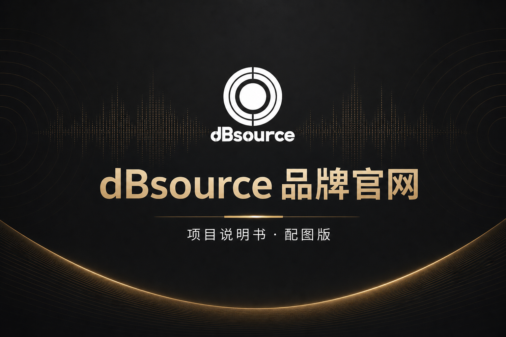
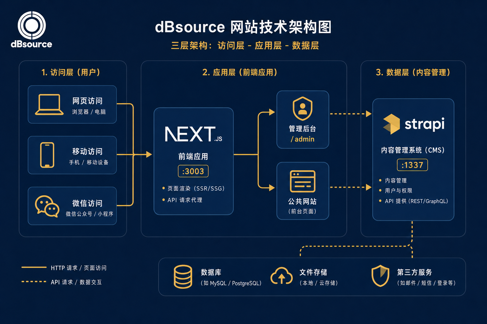
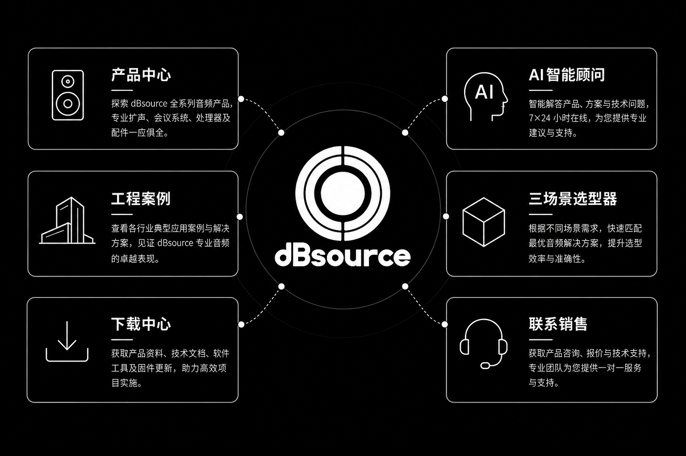
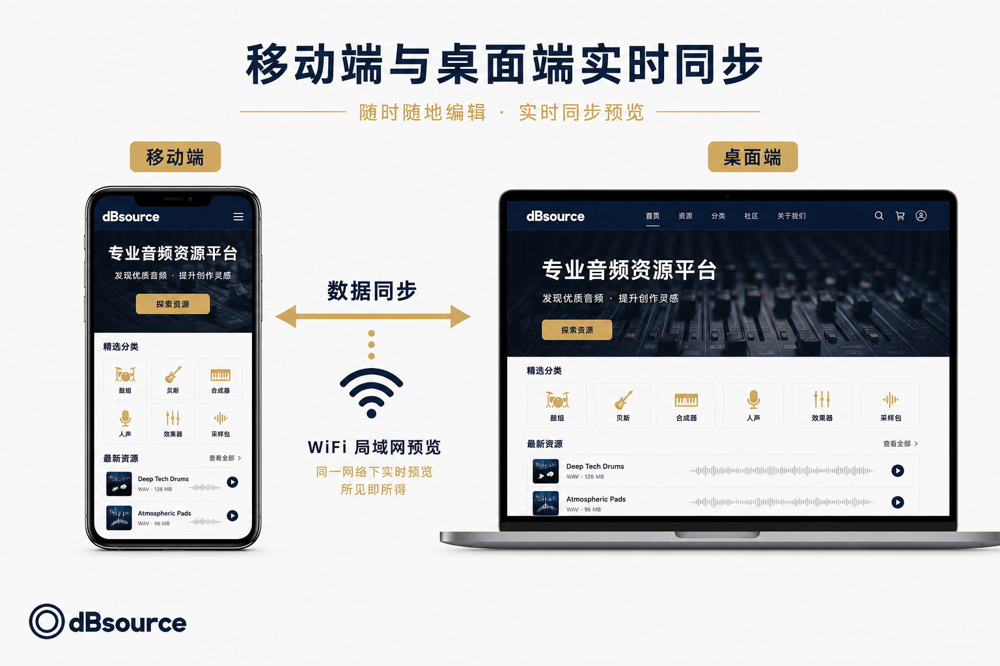
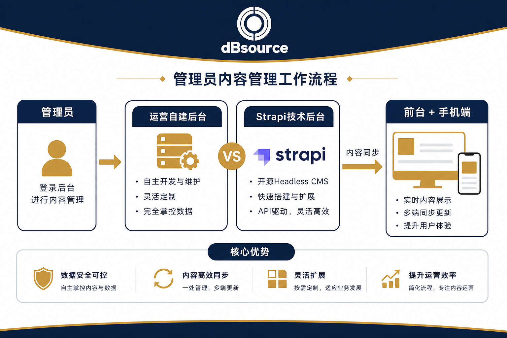

# dBsource 品牌官网 — 项目说明书（配图版）

> **适用对象：** 客户方业务人员、销售、市场运营、技术对接人  
> **版本：** v2.0 · 2026年6月  
> **代码仓库：** [github.com/Bomi11653/dBsource](https://github.com/Bomi11653/dBsource)

---

## 📎 飞书导入指引

1. 新建飞书文档，复制本文正文粘贴进去  
2. 配图文件夹：`docs/images/`（共 5 张 PNG）  
3. 在飞书对应章节位置 → **插入图片** → 选择本地文件上传  
4. 建议顺序：封面 → 架构图 → 功能图 → 手机同步图 → 后台流程图  

---

## 封面



**东莞新声电子科技有限公司 · dBsource**  
专业音响品牌官网 · 前端 + 后端 + 移动端 + AI 智能顾问

---

## 一、项目介绍

### 1.1 项目概述

**dBsource** 是东莞新声电子科技有限公司的专业音响品牌官方网站，集品牌展示、产品选型、工程案例、资料下载、智能咨询与询盘转化于一体。

网站支持 **中英文双语**，适配 **电脑端与手机端**，内容通过后台统一管理，修改后自动同步到前台与移动端。

### 1.2 建设目标

| 目标 | 说明 |
|------|------|
| 品牌展示 | 高端视觉、首页 WebGL 声波动效、滚动叙事案例页 |
| 产品转化 | 55+ 产品型号、系列导航、详情页、三场景选型器 |
| 获客留资 | 联系表单、销售二维码、智能顾问导流 WhatsApp/电话 |
| 内容自治 | 运营人员可自行改文案、图片、产品，无需改代码 |
| 智能服务 | DeepSeek AI 顾问，7×24 解答选型与方案问题 |

### 1.3 系统组成（三端一体）



**图解说明：**

| 层级 | 组件 | 说明 |
|------|------|------|
| 访客层 | 电脑 / 手机 / 微信 | 客户访问入口 |
| 展示层 | Next.js 前端 `:3003` | 官网全部页面与 AI 顾问 |
| 管理层 | `/admin` 自建后台 | 运营日常改内容（推荐） |
| 数据层 | Strapi CMS `:1337` | 底层数据与媒体存储 |

---

## 二、访问地址一览

### 2.1 本地开发环境（当前）

| 端 | 地址 | 用途 |
|----|------|------|
| **前端官网（电脑）** | http://127.0.0.1:3003 | 客户访问的主站 |
| **前端官网（手机）** | http://192.168.1.152:3003 | 同一 WiFi 下手机预览（IP 以本机为准） |
| **自建内容后台** | http://127.0.0.1:3003/admin/login | 运营改内容（推荐） |
| **Strapi 管理后台** | http://localhost:1337/admin | 技术人员 / 高级配置 |
| **数据同步状态** | http://127.0.0.1:3003/api/sync/status | 检查前后端是否联通 |

> **正式上线后**，将 `127.0.0.1` 替换为正式域名，例如 `https://www.dbsource.com`。

### 2.2 后台登录

| 后台 | 登录方式 |
|------|----------|
| 自建内容后台 `/admin` | 口令见 `.env.local` 中 `ADMIN_TOKEN`（由技术同事配置） |
| Strapi 后台 | 首次安装时注册的管理员邮箱 + 密码 |

---

## 三、客户端功能说明（访客 / 客户看到的）

### 3.1 核心功能一览



### 3.2 网站页面导航

| 页面 | 路径 | 功能说明 |
|------|------|----------|
| 首页 | `/` | 品牌主视觉、应用场景、核心产品、精选案例、声波动效 |
| 产品中心 | `/products` | 按系列/子系列浏览，搜索过滤，产品卡片与详情 |
| 产品详情 | `/products/[id]` | 型号参数、图集、规格面板、相关推荐 |
| 工程案例 | `/cases` | 按类型/场景筛选，滚动叙事展示，案例详情与图集 |
| 下载中心 | `/downloads` | 软件、画册、说明书等文件分类下载 |
| 关于我们 | `/about` | 品牌故事、发展历程、系统介绍配图 |
| 联系我们 | `/contact` | 询盘表单 + 四位销售联系人（电话可复制、微信二维码） |
| 智能选型器 | `/configurator` | 三场景（会议/演出/KTV）问答式产品推荐 |
| 智能顾问 | 右下角浮窗 | AI 对话、语音输入、跳转产品/案例/联系销售 |

### 3.3 通用交互功能

| 功能 | 操作方式 | 说明 |
|------|----------|------|
| 中英文切换 | 导航栏语言按钮 | 全站文案切换中/英 |
| 全局搜索 | `Ctrl + K`（电脑） | 产品、案例、下载等同义词智能搜索 |
| 页面过渡动画 | 点击导航自动触发 | 品牌感切换效果 |
| 询盘提交 | 联系页表单 | 提交后写入 Strapi，可接企业微信/钉钉 Webhook |
| SEO | 自动 | 站点地图、结构化数据、Open Graph 分享图 |

### 3.4 智能顾问（AI）

面向客户的免费智能客服，主要能力：

- **多轮对话**：根据场景（会议室、酒吧、户外等）推荐产品与方案
- **页面感知**：在产品和案例页提问时，自动带入当前页面上下文
- **快捷链接**：回答中附带可点击的产品、案例、下载、联系页链接
- **销售导流**：一键 WhatsApp / 电话联系对应销售
- **语音输入**：支持浏览器语音识别（需 HTTPS 或 localhost）
- **满意度反馈**：可对单次回答点赞/点踩
- **离线降级**：AI 余额不足或网络异常时，自动切换规则引擎回答

> 每日对话次数可在后台配置（默认 20 次/访客），相同问题命中缓存不计次。

### 3.5 联系页销售信息

| 姓名 | 电话 |
|------|------|
| 刘德琰 | 13712769500 |
| 孙立霆 Darren | 18368729678 / 13713323136 |
| 钟明远 | 18122928166 |
| 杨雪军 | 18688610987 |

每位销售配有独立微信二维码，电话支持一键复制。

---

## 四、手机端说明

### 4.1 电脑与手机数据同步



### 4.2 手机如何访问

1. 电脑与手机连接 **同一 WiFi**
2. 技术同事在电脑上运行：`npm run dev:mobile`
3. 手机浏览器打开：`http://<电脑局域网IP>:3003`  
   例如：`http://192.168.1.152:3003`

### 4.3 手机端功能（与电脑一致）

| 模块 | 手机端表现 |
|------|------------|
| 首页 | 完整展示，含 WebGL 声波（不降级） |
| 导航 | 汉堡菜单 + mega 下拉（产品/案例/下载子目录） |
| 产品/案例 | 卡片列表、筛选、详情页滑动浏览 |
| 下载 | 分类 Tab + 文件列表，点击下载 |
| 联系 | 表单 + 销售卡片纵向排列，二维码可长按识别 |
| AI 顾问 | 全屏对话浮窗，支持语音输入 |
| 搜索 | 点击搜索图标打开（无物理键盘快捷键） |

### 4.4 手机端图片说明

手机无法直接访问电脑上的 `localhost:1337`。项目已做 **图片同源代理**：

- CMS 图片自动转为 `/strapi-uploads/...`
- 由前端服务器转发到 Strapi
- **手机只需访问前端地址，图片即可正常显示**

### 4.5 微信内打开

- 可直接分享前端链接到微信，点击打开
- 建议正式环境使用 **HTTPS 域名**，微信内体验更稳定
- AI 语音输入在微信内置浏览器可能受限，文字输入不受影响

---

## 五、后台管理说明（运营 / 内容同事）

### 5.1 双后台协作流程



### 5.2 两个后台的区别

| | 自建内容后台 `/admin` | Strapi 后台 |
|--|----------------------|-------------|
| **推荐人群** | 市场、运营、销售助理 | 技术人员 |
| **界面** | 中文、与网站结构一一对应 | 通用 CMS 界面 |
| **能做什么** | 改产品、案例、下载、关于、联系、二维码、系列导航 | 全部数据 + API Token、权限、数据库 |
| **地址** | `:3003/admin/login` | `:1337/admin` |

**日常改内容，请优先使用自建内容后台。**

### 5.3 自建后台可管理模块

| 模块 | 可编辑内容 |
|------|------------|
| 首页 | 应用场景条目 |
| 产品系列 | 导航系列显示/隐藏、排序 |
| 产品中心 | 型号、名称、描述、参数、主图、图集 |
| 工程案例 | 案例标题、场景、产品、封面、现场图集 |
| 下载中心 | 文件名、分类、封面、附件 |
| 关于我们 | 各板块配图 |
| 联系我们 | 公司地址、电话、邮箱；查看询盘列表 |
| 二维码 | 页脚等位置的社交二维码 |

### 5.4 内容修改后多久生效？

- 保存后 **刷新前台页面** 即可看到（Strapi 有约 60 秒缓存，一般几秒内更新）
- 若 Strapi 未启动，网站自动使用内置备用数据，**不会出现白屏**
- 同步状态可访问：`/api/sync/status` 查看 `dataSource` 字段

### 5.5 询盘管理

1. 客户在联系页提交表单
2. 数据写入 Strapi `leads` 集合
3. 运营在 **自建后台 → 联系我们** 查看
4. 可选：配置 `LEAD_WEBHOOK_URL` 推送到企业微信/钉钉群

---

## 六、技术后台说明（技术同事）

### 6.1 项目结构

```
dBsource/                    ← GitHub 单仓库
├── app/                     ← 前端页面与 API
├── components/              ← UI 组件
├── lib/                     ← 业务逻辑、AI、CMS 对接
├── data/                    ← 备用数据、销售信息等
├── public/                  ← 静态图片与资源
├── cms/                     ← Strapi 5 后台项目
├── docs/                    ← 本说明书与配图
├── .env.local               ← 前端密钥（不提交 Git）
└── cms/.env                 ← Strapi 密钥（不提交 Git）
```

### 6.2 启动命令

**前端（电脑预览）：**
```bash
npm install
npm run dev          # 仅本机 127.0.0.1
```

**前端（手机预览）：**
```bash
npm run dev:mobile   # 监听 0.0.0.0，局域网可访问
```

**Strapi 后台：**
```bash
cd cms
npm install
npm run develop      # http://localhost:1337/admin
```

**生产构建：**
```bash
npm run build
npm run start
```

### 6.3 关键环境变量

| 变量 | 作用 |
|------|------|
| `CMS_URL` | Strapi 地址（服务端拉数据） |
| `NEXT_PUBLIC_CMS_URL` | Strapi 地址（客户端，一般与上一致） |
| `NEXT_PUBLIC_USE_MOCK_DATA` | `false` = 用 Strapi；`true` = 纯本地数据 |
| `ADMIN_TOKEN` | 自建后台登录口令 |
| `DEEPSEEK_API_KEY` | AI 顾问密钥 |
| `STRAPI_API_TOKEN` | 读取询盘等私有 API |
| `LEAD_WEBHOOK_URL` | 询盘推送 Webhook（可选） |

### 6.4 常见问题处理

| 现象 | 处理 |
|------|------|
| 页面黑屏/白屏 | 删除 `.next` 文件夹，重新 `npm run dev` |
| 图片不显示 | 确认 Strapi 已启动；手机只用前端 IP 访问 |
| AI 报错余额不足 | DeepSeek 账户充值，或自动走离线规则回答 |
| 端口被占用 | 运行 `node scripts/kill-port.mjs 3003` 后重启 |
| CMS 挂了但网站要上线 | 自动 fallback 到 mock 数据，访客仍可浏览 |

---

## 七、功能清单总表

### 7.1 前台（客户可见）

- [x] 中英文双语
- [x] 响应式布局（电脑 + 手机）
- [x] 首页 WebGL 声波动效
- [x] 产品系列 mega 导航
- [x] 产品搜索与筛选
- [x] 案例滚动叙事
- [x] 下载中心分类
- [x] 联系表单 + 销售 QR
- [x] 三场景智能选型器
- [x] DeepSeek AI 智能顾问
- [x] 全局搜索 Ctrl+K
- [x] SEO / Sitemap / JSON-LD

### 7.2 后台（运营可用）

- [x] 自建 `/admin` 内容管理
- [x] Strapi CMS 全量管理
- [x] 图片上传与管理
- [x] 产品系列显示配置
- [x] 询盘收集与查看
- [x] CMS 健康检查与自动降级

### 7.3 移动端

- [x] 局域网手机预览
- [x] 图片同源代理（无需改 CMS 地址）
- [x] 完整功能（含 WebGL、AI）
- [x] 销售二维码长按识别

---

## 八、部署与后续规划建议

| 阶段 | 建议 |
|------|------|
| 内网演示 | 当前方案：`dev:mobile` + 局域网 IP |
| 测试上线 | 云服务器部署 Next.js + Strapi，绑定测试域名 + HTTPS |
| 正式上线 | 备案域名、CDN 加速、定期备份 `cms/.tmp` 与 `uploads` |
| 运营培训 | 使用本说明书第五节，实操 `/admin` 各模块 |
| 可选扩展 | 企业微信询盘通知、GA4 统计、多语言扩展 |

---

## 九、联系与支持

| 项目 | 信息 |
|------|------|
| 品牌 | 东莞新声电子科技有限公司 · dBsource |
| 代码仓库 | https://github.com/Bomi11653/dBsource |
| 技术栈 | Next.js 14 · Strapi 5 · TypeScript · Tailwind · DeepSeek |

---

## 附录：配图文件清单

| 文件名 | 用途 | 插入位置 |
|--------|------|----------|
| `docs-cover.png` | 文档封面 | 文首 |
| `docs-architecture.png` | 三端系统架构 | 第一章 1.3 |
| `docs-features.png` | 客户端核心功能 | 第三章 3.1 |
| `docs-mobile-sync.png` | 电脑/手机同步 | 第四章 4.1 |
| `docs-admin-workflow.png` | 双后台协作 | 第五章 5.1 |

*配图版说明书 · 可直接复制到飞书并上传 `docs/images/` 内图片*
